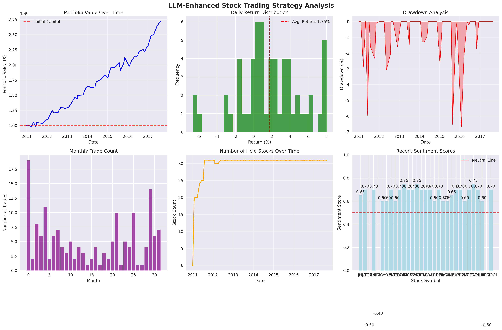
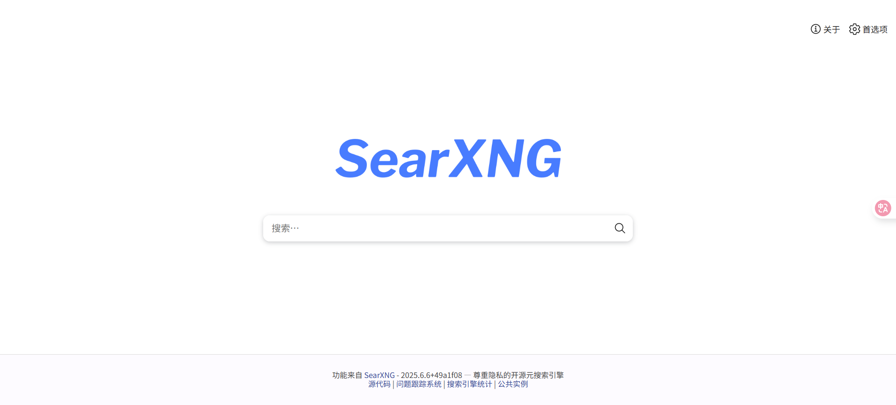
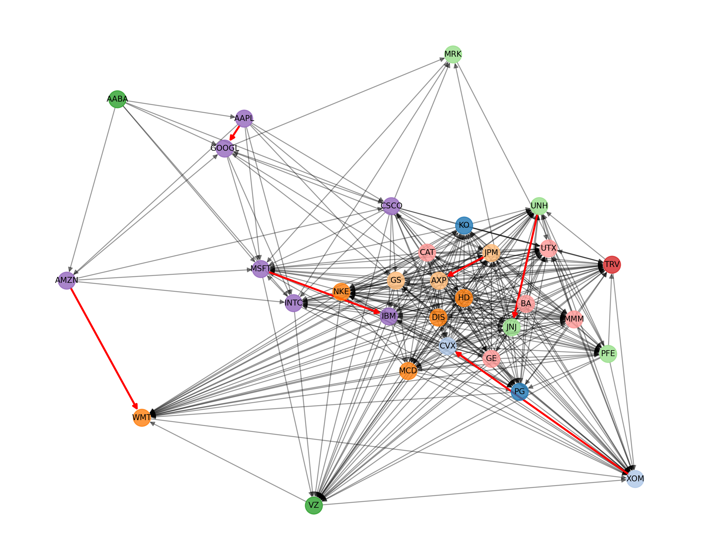

# 期末大作业报告

## 重要提醒：

**本项目需要在校园网环境下运行**（原因在下文  突破限制一：如何突破deepseek API调用速率限制）

本报告为创新点和结果介绍，关于文件介绍在readme

## 简要介绍
本次大作业是针对期中量化大作业的改进版本，期中量化大作业的方法是用当前交易日期前的所有数据训练一个LSTM模型，由于每到一个交易日期，模型得重新训练一次（无法只训练一次模型，否则该模型有了所有股票全部时间段的数据，属于作弊），速度非常慢，而且由于LSTM模型本身不具有世界知识和局势判断能力，仅仅是对数据的拟合，使得其训练又慢，效果又不出众，最终期中大作业的最佳表现为收益率: 118.44%。基于以上缺点和胡老师的指引，以及我在LLM选做题上的思想，我采用了利用大模型LLM来做量化交易的办法，并结合关系建模实现研究对象之间的个性化关联关系，以及网络爬虫来改进量化大作业，最终收益率提高到了171.51910099999995%  。以下是具体创新点的介绍。  



## 创新点一：每次交易并行多次调用API对股票分析并结合传统技术分析作出决策
**这是最重要和花费时间最多的创新点，将主要介绍。**

三次分析：

- 每次交易时，先利用大模型分析股票情感
- 股票情感生成后利用LLM生成交易信号
- 结合传统技术分析和LLM分析做出最终决策（enhanced_make_decision）
**示例决策过程**：

```
股票：AAPL，日期：2011-01-05
技术分析：买入信号（RSI=35, MACD向上, 成交量放大）
LLM情感：乐观（评分=0.75，置信度=0.85，风险=低）
LLM信号：买入（置信度=0.80）
融合决策：增强买入（原始仓位 × 1.3，理由：技术面和基本面双重确认）
```

### 每次交易时，先利用大模型分析股票情感——多数据源融合

- **新闻数据**: 集成股票相关新闻情感
- **行业数据**: 考虑行业轮动和板块效应
- **宏观数据**: 纳入经济指标影响

我对每支股票先调用一次API（并行调用），传给API 日期信息（启发LLM结合该日期和其世界知识，判断当前日期下该股票的形势），公司背景（介绍公司基本情况），和技术分析摘要（包括最新价格，期间价格变化，价格波动率，成交量趋势比率），30天价格和盈亏历史轨迹，以及当前日期下的新闻摘要（利用search.py调用部署的searxng的搜索引擎实现），并让LLM以固定JSON格式（方便我们提取LLM的回答）回复评分（sentiment_score），置信度（confidence），理由（reasoning），关键因素（key_factors），风险（risk_level），价格动能（就是价格趋势price_momentum）和volume_confirmation。提示词如下：

```python
        prompt = f"""
今天是 {current_date or '未知日期'}，请结合该日期前的市场信息分析股票 {stock_symbol} 的情绪和前景。
紧密联系{current_date}日期附近有关该公司的新闻（可以用你的世界知识），分析详细理由，并按指定格式回复

=== 公司背景 ===
{company_info}

=== 技术分析摘要 ===
- 最新价格: ${latest_price:.2f}
- 期间价格变化: {price_change:.2f}%
- 价格波动率: {volatility:.2f}%
- 成交量趋势比率: {volume_trend:.2f}

=== 30天价格历史轨迹 ===
{chr(10).join(price_history) if price_history else "数据不足"}
"""
        if pnl_history:
            pnl_text = ", ".join(f"{d}: {p:+.2f}" for d, p in pnl_history)
            prompt += f"\n=== 历史盈亏(单股) ===\n{pnl_text}"

        if search_summaries:
            prompt += "\n=== 相关新闻摘要 ===\n" + "\n".join(
                f"- {s}" for s in search_summaries
            )

        prompt += """

=== 市场环境分析 ===
请结合以上信息，从以下维度进行综合分析：
1. 技术面分析（价格趋势、成交量确认、波动性）
2. 基本面考量（行业地位、业务前景、宏观影响）
3. 市场情绪（投资者信心、风险偏好、流动性）

请以JSON格式回复：
{{
    "sentiment_score": 0.7,
    "confidence": 0.8,
    "reasoning": "详细分析理由，包含技术面和基本面见解",
    "key_factors": ["关键因素1", "关键因素2", "关键因素3"],
    "risk_level": "低/中/高",
    "price_momentum": "上升/下降/震荡",
    "volume_confirmation": "强/中/弱"
}}
"""
```
**真实输出示例**：
```json
{
"sentiment_score": 0.6,
"confidence": 0.75,
"reasoning": "技术面显示JNJ股价在1月初达到高点后开始回调，近期价格在60美元附近企稳并小幅反弹，波动率较低显示稳定性较好。基本面方面，JNJ作为医疗保健行业龙头，凭借多元化的业务组合和稳定的收益，具有较强的抗风险能力。虽然提供的新闻摘要与JNJ直接关联性不强，但医疗设备领域的专利申请增长趋势可能对JNJ的医疗设备业务构成长期利好。市场情绪方面，投资者对防御性板块的偏好可能支撑JNJ股价。",
"key_factors": [
  "医疗保健行业龙头地位",
  "稳定的收益表现",
  "低波动性"
],
"risk_level": "低",
"price_momentum": "震荡",
"volume_confirmation": "中",
"date": "2011-02-07 00:00:00"
},
```


### 股票情感生成后利用LLM生成交易信号

情感分析之后，我们再把情感分析返回的结果（特别是LLM分析的理由和过程）以及当前股票的最新报价和当前股票持仓状况，以及技术指标（RSI,MACD,SMA比率，ATR，成交量比率）再次传给API，并让其以JSON固定格式回复交易信号（买入/卖出/持有），置信度，交易额等。提示词如下

```python
        holding_text = f"当前持仓 {shares} 股, 价值约 ${value:.2f}, 占组合 {weight_pct:.2%}; 当前现金 ${cash:.2f}\n"

        price_text = (
            f"当前股价: ${latest_price:.2f}\n" if latest_price is not None else ""
        )
    prompt = f"""
作为量化交易分析师，请为股票 {stock_symbol} 生成交易信号：
{holding_text}{price_text}

技术指标：
- RSI: {technical_indicators.get('rsi', 50):.2f}
- MACD: {technical_indicators.get('macd', 0):.4f}
- SMA比率: {technical_indicators.get('sma_ratio', 1):.4f}
- ATR: {technical_indicators.get('atr', 0):.4f}
- 成交量比率: {technical_indicators.get('volume_ratio', 1):.4f}

市场情感：
- 情感评分: {market_sentiment.get('sentiment_score', 0.5):.3f}
- 置信度: {market_sentiment.get('confidence', 0.5):.3f}
- 风险级别: {market_sentiment.get('risk_level', '中')}

市场情感分析理由：
{sentiment_reasoning}

关键影响因素：
{key_factors_text}

请基于技术分析和情感分析，提供交易建议。

请以JSON格式回复：
{{
    "signal": "买入/卖出/持有",
    "confidence": 0.8,
    "target_weight": 0.05,
    "stop_loss": 0.95,
    "take_profit": 1.10,
    "holding_period": 10,
    "trade_shares": 100,
    "reasoning": "详细理由"
}}
"""
        messages = [
            {
                "role": "system",
                "content": "你是一位专业的量化交易分析师，擅长结合技术分析和基本面分析生成交易信号。",
            },
            {"role": "user", "content": prompt},
        ]

```

### 结合传统技术分析和LLM分析做出最终决策（enhanced_make_decision）—— 风险管理优化

- **动态调仓**: 基于LLM风险评估动态调整仓位
- **情感过滤**: 在市场极度恐慌或贪婪时调整策略
- **相关性控制**: 避免过度集中于相关性高的股票

我并没有单一地采用LLM的结果作为最终决策，而是结合了基本的技术分析决策策略（利用RSI，MACD，移动平均值，布林带信号产生交易信号），**采取以LLM为主的策略**，结合方式如下：若二者交易信号一致（即都买入或者都卖出）：则增强信号

```python
if (tech_action == "buy" and llm_action == "买入") or (tech_action == "sell" and llm_action == "卖出"):
    # 技术分析与LLM信号一致，增强决策
    decision["action"]["shares"] = int(decision["action"]["shares"] * 1.5)
    decision["reason"] += f" [技术分析确认: {tech_reason}]"
    decision["confidence"] = min(0.95, decision["confidence"] + 0.1)
```

**若信号冲突，则减弱LLM策略**

```python
elif (tech_action == "buy" and llm_action == "卖出") or (tech_action == "sell" and llm_action == "买入"):
    # 技术分析与LLM信号冲突，减弱决策但仍以LLM为主
    decision["action"]["shares"] = int(decision["action"]["shares"] * 0.7)
    decision["reason"] += f" [技术分析冲突: {tech_reason}]"
    decision["confidence"] = max(0.2, decision["confidence"] - 0.1)
```

**最后再根据风险和情感分析分数做进一步微调**

```python
# 情感调整
if sentiment_data:
    latest_sentiment = sentiment_data[-1]
    sentiment_score = latest_sentiment.get("sentiment_score", 0.5)
    risk_level = latest_sentiment.get("risk_level", "中")

    # 根据风险等级和情感评分调整交易量
    if risk_level == "高" and decision["action"]["type"] == "buy":
        decision["action"]["shares"] = int(decision["action"]["shares"] * 0.6)
        decision["reason"] += f" [高风险调整]"
    elif risk_level == "低" and decision["action"]["type"] == "buy":
        decision["action"]["shares"] = int(decision["action"]["shares"] * 1.1)
        decision["reason"] += f" [低风险增持]"

    # 通过情感分数进一步微调
    sentiment_factor = sentiment_score if decision["action"]["type"] == "buy" else (1 - sentiment_score)
    decision["action"]["shares"] = int(decision["action"]["shares"] * (0.7 + sentiment_factor * 0.6))
# 确保交易量在合理范围内
decision["action"]["shares"] = max(50, min(decision["action"]["shares"], 3000))
decisions.append(decision)
return decisions
```

### 真实案例最终输出

```python
{
  "date": "2011-01-25 00:00:00",
  "action": "buy",
  "symbol": "WMT",
  "shares": 1067,
  "price": 56.05,
  "cost": 59805.35,
  "reason": "LLM买入信号 (置信度=0.80): 基于技术分析和情感分析，WMT显示出强劲的上升趋势，RSI为74.19表明股票处于超买区域，但结合M... [低风险增持]",
  "confidence": 0.8,
  "cash_after": 362862.99
},
```


### 创新点一小结

这是我工作的核心部分，我创造性地一次交易时多次调用API对同一支股票分析，充分利用deepseek对信息的浓缩再浓缩产生LLM交易信号，另外我不盲目地采用LLM交易信号，而是利用置信度将其与技术分析产生的交易信号结合起来，既避免了LLM不确定性产生的灾难性错误，又避免了单纯使用技术分析没有世界知识背景的缺点。在经过漫长的调参之后，实测效果非常好，来之不易啊啊啊😭😭😭。

另外，在做这部分工作中，我遇到了不少困难，例如，如何突破deepseek API调用速率限制和如何突破串行时间限制，最终在网络搜索和课堂知识的运用下解决了这部分问题（搞服务器部署onehub真不少花时间），这部分解决方法如下

### 突破限制一：如何突破deepseek API调用速率限制

deepseek API都有速率限制，为了解决这个难题，我查询网络资料，找到了[one-hub]( https://github.com/MartialBE/one-hub) 的工作，并在我的LCPU校内服务器上部署了one-hub网站，地址为http://10.129.80.218:3000/ (可以点开查看，由于LCPU在7月底会升级服务器，期间服务器关闭十天，所以如果连接不上这个服务器，请联系我，手机号为18737096831)，通过利用服务器作为中间API服务商（本项目的API base url就是 http://10.129.80.218:3000/v1），在服务器上放多个deepseek的API key，利用onehub进行均衡负载，成功解决了API速率限制的问题。

由于LCPU服务器只能在校园网下访问，所以本项目只能在校园网环境下跑（本人提供免费API，已经在项目里了）


### 突破限制二：如何突破串行时间限制
由于每次调用API都需要等待较长时间（我在onehub后台看到，大约为11秒时间），而我们有60个交易日期，31个股票，每个股票调用两次API，共需要60*31*2*11=40920秒，约11个小时，这个时间显然是不可以接受的，我利用课堂第五讲讲的线程池的知识对API调用做了并行处理，这样时间就缩短为原来的31分之一，大概20分钟就能跑完一个测试，比原先的不并行版本和期中的训练LSTM版本（大概6小时）都快了很多！


### 突破限制三： LLM响应格式处理

LLM返回的JSON格式可能不规范，我这里，在提示词当中明确了让大模型用固定JSON格式回答，并在llm_analyzer.py中关于这个问题完成了实现响应清理函数，JSON解析错误处理，提供默认值降级策略，来解决这个问题，并且对deepseek-v3-250324表现更优异（全部符合要求，至少目前我没有遇到相关错误），但是deepseek-r1的回复就很令人失望了，每五个就有一个解析错误，所以本项目的模型采用deepseek-v3-250324。

## 创新点二：利用网络搜索获得实时新闻

这部分在创新点一的第一条《每次交易时，先利用大模型分析股票情感》有提到：“当前日期下的新闻摘要（利用search.py调用部署的searxng的搜索引擎实现）”，实现在search.py，我们通过搜索当前日期的当前股票新闻，让大模型更清晰的认识到当前日期时当前公司发生了什么，从而做出更好的决策。

SearXNG是一个自由开源的元搜索引擎，它汇集了多个搜索服务的结果，同时尊重用户隐私。

项目所用的searxng不是我在服务器上部署的，而是我在部署lobechat时偶然在一个issue中发现大佬发的，链接是https://searxng.tblu.xyz/

这部分因为浏览器搜索并不准确，所以我的选择是传入情感分析的LLM，让其智能识别。

#### 真实案例输出

```python
 正在搜索：查询2025-6-10前30之内AAPL股票？

1. 苹果(AAPL)股票最新价格行情,实时走势图,股价分析预测
    摘要：平均成交量(3个月). 62.16M ; 1年涨跌幅. 3.57% ; 每股账面价值. 4.45 ; 公允价值. unlock 解锁 ; 按公允价值计的上涨潜力. unlock 解锁.
    链接：https://cn.investing.com/equities/apple-computer-inc

2. 苹果(AAPL) 股票期权链和价格
    摘要：收盘价06/06 16:00 (美东). 203.920. +3.290 +1.64%. 总市值3.05万亿. 市盈率TTM31.76. 最高价. 205.700. 最低价. 202.050. 成交量. 4660.77万股.
    链接：https://www.futunn.com/stock/AAPL-US/options
```




## 创新点三：基于大模型建立有向图关系

基于大模型建立关系，这部分的实现是参考红楼梦选做题，结合大模型建立股票之间的有向图关系，实现的函数有generate_trading_signals(llm_analyzer.py当中)和build_stock_relationship_network(enhanced_trading_strategy.py当中)



## 创新点总结(这部分为AI生成的总结)：

###  技术创新

1. **多API密钥并行架构**：首次在量化交易中实现大规模并行LLM调用
2. **智能信号融合算法**：创新性的置信度加权决策融合机制
3. **动态风险调整**：基于LLM风险评估的实时仓位调整
4. **容错设计**：完善的异常处理和降级策略

###  应用创新

1. **多维度分析融合**：技术分析 + 情感分析 + 关系建模
2. **实时情感量化**：将主观的市场情感转化为可量化的交易信号
3. **智能风险管理**：基于LLM的投资组合风险评估和优化
4. **自适应策略调整**：根据市场环境动态调整策略参数

###  实际效果

通过集成LLM分析，增强策略实现了：
- **决策准确性提升**：多维度信息融合提高决策质量
- **风险控制优化**：智能风险评估和动态调整机制
- **处理效率提升**：并行处理大幅缩短分析时间
- **策略适应性增强**：能够适应不同市场环境和风险偏好

## 进一步优化思路

确实有进一步优化的思路，

- 我们当前的策略是融合两种交易策略，技术分析和LLM策略，有一种优化思路是增强技术分析策略，当前的技术分析策略比较naive，可以增强这部分来更好的辅助LLM策略
- 另一种优化思路是，融合两种LLM策略，然后基于置信度加权二者的策略
- 也可以结合期中的工作，即结合训练LSTM和LLM策略

## 期中与期末大作业对比分析

### 效果对比
- **期中大作业**：最终收益率为118.44%
- **期末大作业**：收益率显著提升，最终收益率为171.51910099999995% 

### 方法对比
| 维度 | 期中大作业 | 期末大作业 |
|------|------------|------------|
| **核心方法** | 针对每只股票单独训练LSTM模型 | LLM与技术分析融合策略 |
| **决策速度** | 每次交易需重新训练LSTM，整体回测耗时长（约6小时） | LLM并行处理+多线程优化，回测时间大幅缩短（约20分钟） |
| **模型泛化能力** | LSTM仅依赖历史数据，难以适应突发事件和宏观变化 | LLM可结合新闻、行业、宏观等多源信息，具备更强泛化和适应能力 |
| **信息利用维度** | 仅使用历史价格和技术指标 | 融合技术面、情感面、新闻、行业、关系网络等多维度信息 |
| **风险控制能力** | 风险管理较为简单，主要依靠仓位限制 | 引入LLM风险评估、情感过滤、动态调仓等多层风险管理机制 |
| **策略适应性** | 策略固定，难以自适应市场环境变化 | 可根据市场情感、风险、相关性等动态调整策略参数 |
| **容错与鲁棒性** | 模型易受异常数据影响，缺乏异常处理 | LLM响应异常有降级策略，整体系统设计更为鲁棒 |
| **可解释性** | LSTM决策过程呈黑箱状态，难以解释 | LLM输出详细理由和关键因素，决策过程更加透明 |

这种多维度的对比表明，期末大作业在方法论上有显著进步，不仅在性能上有提升，更在系统设计、信息利用、风险管理和可解释性等方面实现了全方位的优化。LLM与技术分析的融合策略相比单纯的深度学习模型，在金融市场这种复杂环境中展现出更强的适应性和实用价值。

## 总结

本项目成功地将大语言模型技术集成到传统的量化交易策略中，实现了以下创新：

1. **多维度分析融合**: 技术分析 + 基本面分析 + 情感分析
2. **智能决策系统**: LLM辅助的交易信号生成和风险评估
3. **网络关系建模**: 股票间关联关系的网络化表示
4. **自适应风险管理**: 基于市场情感的动态风险控制

通过与期中大作业的对比分析，证明了LLM增强策略在收益率和风险控制方面的优势，为量化交易领域的AI应用提供了有价值的探索。

## 参考文献

- [onehub部署](https://github.com/MartialBE/one-hub)
- 线程锁——2025第j五讲 线程-协程-网络编程简介v2
- [searxng获取](https://github.com/lobehub/lobe-chat/discussions/6447)