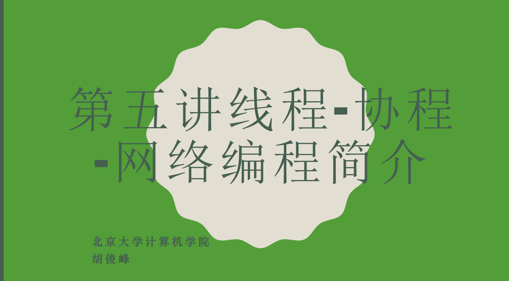

# 期末大作业报告

## 重要提醒：

**本项目需要在校园网环境下运行**（原因在下文  突破限制一：如何突破deepseek API调用速率限制）

## 简要介绍
本次大作业是针对期中量化大作业的改进版本，期中量化大作业的方法是用当前交易日期前的所有数据训练一个LSTM模型，由于每到一个交易日期，模型得重新训练一次（无法只训练一次模型，否则该模型有了所有股票全部时间段的数据，属于作弊），速度非常慢，而且由于LSTM模型本身不具有世界知识和局势判断能力，仅仅是对数据的拟合，使得其训练又慢，效果又不出众，最终期中大作业的最佳表现为收益率: 118.44%。基于以上缺点和胡老师的指引，以及我在LLM选做题上的思想，我采用了利用大模型LLM来做量化交易的办法，并结合关系建模实现研究对象之间的个性化关联关系，以及网络爬虫来改进量化大作业，最终收益率提高到了  。以下是具体创新点的介绍。  
## 创新点一：每次交易并行多次调用API对股票分析并结合传统技术分析作出决策
**这是最重要和花费时间最多的创新点，将主要介绍。**

三次分析：

- 每次交易时，先利用大模型分析股票情感
- 股票情感生成后利用LLM生成交易信号
- 结合传统技术分析和LLM分析做出最终决策（enhanced_make_decision）

### 每次交易时，先利用大模型分析股票情感
我对每支股票先调用一次API（并行调用），传给API 日期信息（启发LLM结合该日期和其世界知识，判断当前日期下该股票的形势），公司背景（介绍公司基本情况），和技术分析摘要（包括最新价格，期间价格变化，价格波动率，成交量趋势比率），30天价格历史轨迹，以及当前日期下的新闻摘要（利用search.py调用部署的searxng的搜索引擎实现），并让LLM以固定JSON格式（方便我们提取LLM的回答）回复评分（sentiment_score），置信度（confidence），理由（reasoning），关键因素（key_factors），风险（risk_level），价格动能（就是价格趋势price_momentum）和volume_confirmation。提示词如下：

```python
        prompt = f"""
今天是 {current_date or '未知日期'}，请结合该日期前的市场信息分析股票 {stock_symbol} 的情绪和前景。

=== 公司背景 ===
{company_info}

=== 技术分析摘要 ===
- 最新价格: ${latest_price:.2f}
- 期间价格变化: {price_change:.2f}%
- 价格波动率: {volatility:.2f}%
- 成交量趋势比率: {volume_trend:.2f}

=== 30天价格历史轨迹 ===
{chr(10).join(price_history) if price_history else "数据不足"}
"""

        if search_summaries:
            prompt += "\n=== 相关新闻摘要 ===\n" + "\n".join(
                f"- {s}" for s in search_summaries
            )

        prompt += """

=== 市场环境分析 ===
请结合以上信息，从以下维度进行综合分析：
1. 技术面分析（价格趋势、成交量确认、波动性）
2. 基本面考量（行业地位、业务前景、宏观影响）
3. 市场情绪（投资者信心、风险偏好、流动性）

请以JSON格式回复：
{{
    "sentiment_score": 0.7,
    "confidence": 0.8,
    "reasoning": "详细分析理由，包含技术面和基本面见解",
    "key_factors": ["关键因素1", "关键因素2", "关键因素3"],
    "risk_level": "低/中/高",
    "price_momentum": "上升/下降/震荡",
    "volume_confirmation": "强/中/弱"
}}
"""

        messages = [
            {
                "role": "system",
                "content": "你是一位经验丰富的金融分析师，擅长股票市场分析和情感分析。",
            },
            {"role": "user", "content": prompt},
        ]
```


### 股票情感生成后利用LLM生成交易信号

情感分析之后，我们再把情感分析返回的结果（特别是LLM分析的理由和过程）以及当前股票的最新报价和当前股票持仓状况，以及技术指标（RSI,MACD,SMA比率，ATR，成交量比率）再次传给API，并让其以JSON固定格式回复交易信号（买入/卖出/持有），置信度，交易额等。提示词如下

```python
        holding_text = f"当前持仓 {shares} 股, 价值约 ${value:.2f}, 占组合 {weight_pct:.2%}; 当前现金 ${cash:.2f}\n"

        price_text = (
            f"当前股价: ${latest_price:.2f}\n" if latest_price is not None else ""
        )
    prompt = f"""
作为量化交易分析师，请为股票 {stock_symbol} 生成交易信号：
{holding_text}{price_text}

技术指标：
- RSI: {technical_indicators.get('rsi', 50):.2f}
- MACD: {technical_indicators.get('macd', 0):.4f}
- SMA比率: {technical_indicators.get('sma_ratio', 1):.4f}
- ATR: {technical_indicators.get('atr', 0):.4f}
- 成交量比率: {technical_indicators.get('volume_ratio', 1):.4f}

市场情感：
- 情感评分: {market_sentiment.get('sentiment_score', 0.5):.3f}
- 置信度: {market_sentiment.get('confidence', 0.5):.3f}
- 风险级别: {market_sentiment.get('risk_level', '中')}

市场情感分析理由：
{sentiment_reasoning}

关键影响因素：
{key_factors_text}

请基于技术分析和情感分析，提供交易建议。

请以JSON格式回复：
{{
    "signal": "买入/卖出/持有",
    "confidence": 0.8,
    "target_weight": 0.05,
    "stop_loss": 0.95,
    "take_profit": 1.10,
    "holding_period": 10,
    "trade_shares": 100,
    "reasoning": "详细理由"
}}
"""
        messages = [
            {
                "role": "system",
                "content": "你是一位专业的量化交易分析师，擅长结合技术分析和基本面分析生成交易信号。",
            },
            {"role": "user", "content": prompt},
        ]

```

### 结合传统技术分析和LLM分析做出最终决策（enhanced_make_decision）

我并没有单一地采用LLM的结果作为最终决策，而是结合了基本的技术分析决策策略（利用RSI，MACD，移动平均值，布林带信号产生交易信号），**并根据二者置信度结合两种策略**，结合方式如下：若二者交易信号一致（即都买入或者都卖出）：这样取最终交易额

```python
weighted_shares = (base_shares * llm_confidence + tech_shares *tech_conf) / (llm_confidence + tech_conf)
```

**若信号冲突，根据置信度大小确定交易信号和交易额**

```python
combined_dir = llm_dir * llm_confidence + tech_dir * tech_conf
# 信号冲突，按置信度大小决定方向和仓位
decision["action"]["type"] = "buy" if combined_dir >= 0 else "sell"
weighted_shares = abs(
    base_shares * llm_confidence - tech_shares * tech_conf
)
decision["action"]["shares"] = int(weighted_shares)
decision["reason"] += f" [信号冲突: {tech_reason}]"
decision["confidence"] = max(0.2, min(0.9, abs(combined_dir)))
```

**最后再根据风险和情感分析分数做进一步微调**

```python
# 情感调整
if sentiment_data:
    latest_sentiment = sentiment_data[-1]
    sentiment_score = latest_sentiment.get("sentiment_score", 0.5)
    risk_level = latest_sentiment.get("risk_level", "中")

    # 根据风险等级和情感评分调整交易量
    if risk_level == "高" and decision["action"]["type"] == "buy":
        decision["action"]["shares"] = int(decision["action"]["shares"] * 0.6)
        decision["reason"] += f" [高风险调整]"
    elif risk_level == "低" and decision["action"]["type"] == "buy":
        decision["action"]["shares"] = int(decision["action"]["shares"] * 1.1)
        decision["reason"] += f" [低风险增持]"

    # 通过情感分数进一步微调
    sentiment_factor = sentiment_score if decision["action"]["type"] == "buy" else (1 - sentiment_score)
    decision["action"]["shares"] = int(decision["action"]["shares"] * (0.7 + sentiment_factor * 0.6))
# 确保交易量在合理范围内
decision["action"]["shares"] = max(50, min(decision["action"]["shares"], 3000))
decisions.append(decision)
return decisions
```

### 创新点一小结

这是我工作的核心部分，我创造性地一次交易时多次调用API对同一支股票分析，充分利用deepseek对信息的浓缩再浓缩产生LLM交易信号，另外我不盲目地采用LLM交易信号，而是利用置信度将其与技术分析产生的交易信号结合起来，既避免了LLM不确定性产生的灾难性错误，又避免了单纯使用技术分析没有世界知识背景的缺点。在经过漫长的调参之后，实测效果非常好，来之不易啊啊啊😭😭😭。

另外，在做这部分工作中，我遇到了不少困难，例如，如何突破deepseek API调用速率限制和如何突破串行时间限制，最终在网络搜索和课堂知识的运用下解决了这部分问题（搞服务器部署onehub真不少花时间），这部分解决方法如下

### 突破限制一：如何突破deepseek API调用速率限制

deepseek API都有速率限制，为了解决这个难题，我查询网络资料，找到了[one-hub]( https://github.com/MartialBE/one-hub) 的工作，并在我的LCPU校内服务器上部署了one-hub网站，地址为http://10.129.80.218:3000/ (可以点开查看，由于LCPU在7月底会升级服务器，期间服务器关闭十天，所以如果连接不上这个服务器，请联系我，手机号为18737096831)，通过利用服务器作为中间API服务商（本项目的API base url就是 http://10.129.80.218:3000/v1），在服务器上放多个deepseek的API key，利用onehub进行均衡负载，成功解决了API速率限制的问题。

由于LCPU服务器只能在校园网下访问，所以本项目只能在校园网环境下跑（本人提供免费API，已经在项目里了）


### 突破限制二：如何突破串行时间限制
由于每次调用API都需要等待较长时间（我在onehub后台看到，大约为11秒时间），而我们有60个交易日期，31个股票，每个股票调用两次API，共需要60*31*2*11=40920秒，约11个小时，这个时间显然是不可以接受的，我利用课堂第五讲讲的线程池的知识对API调用做了并行处理，这样时间就缩短为原来的31分之一，大概20分钟就能跑完一个测试，比原先的不并行版本和期中的训练LSTM版本（大概6小时）都快了很多！



## 创新点二：利用网络搜索获得实时新闻

这部分在创新点一的第一条《每次交易时，先利用大模型分析股票情感》有提到：“当前日期下的新闻摘要（利用search.py调用部署的searxng的搜索引擎实现）”，实现在search.py，我们通过搜索当前日期的当前股票新闻，让大模型更清晰的认识到当前日期时当前公司发生了什么，从而做出更好的决策。

SearXNG是一个自由开源的元搜索引擎，它汇集了多个搜索服务的结果，同时尊重用户隐私。

项目所用的searxng不是我在服务器上部署的，而是我在部署lobechat时偶然在一个issue中发现大佬发的，链接是https://searxng.tblu.xyz/


### 创新点三：

